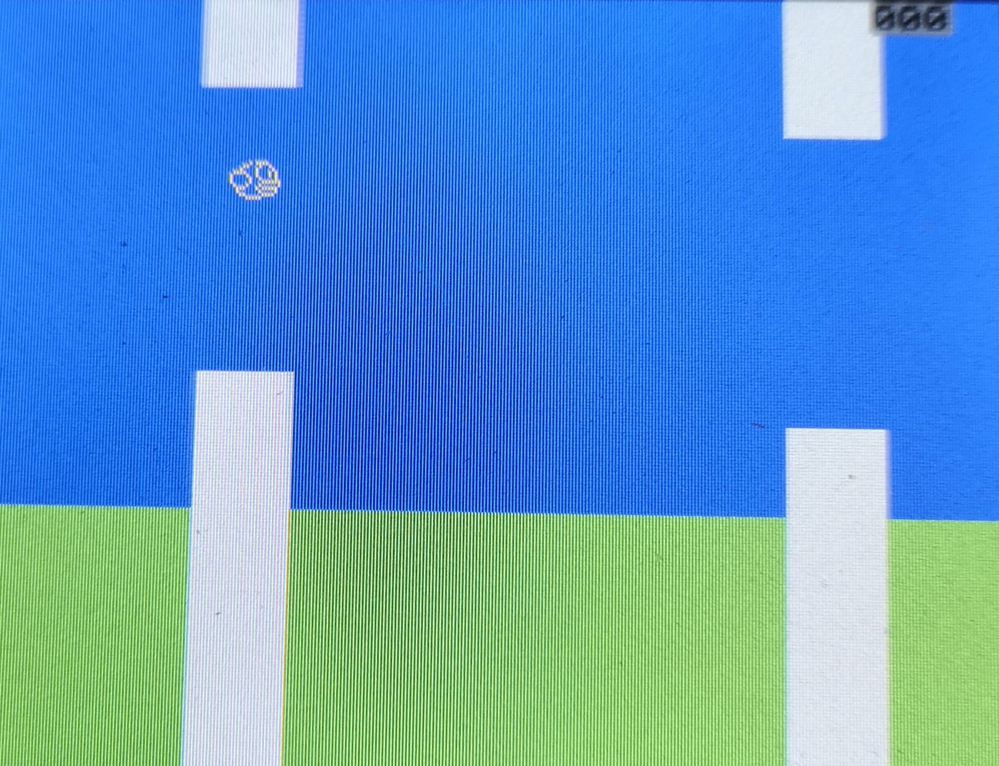
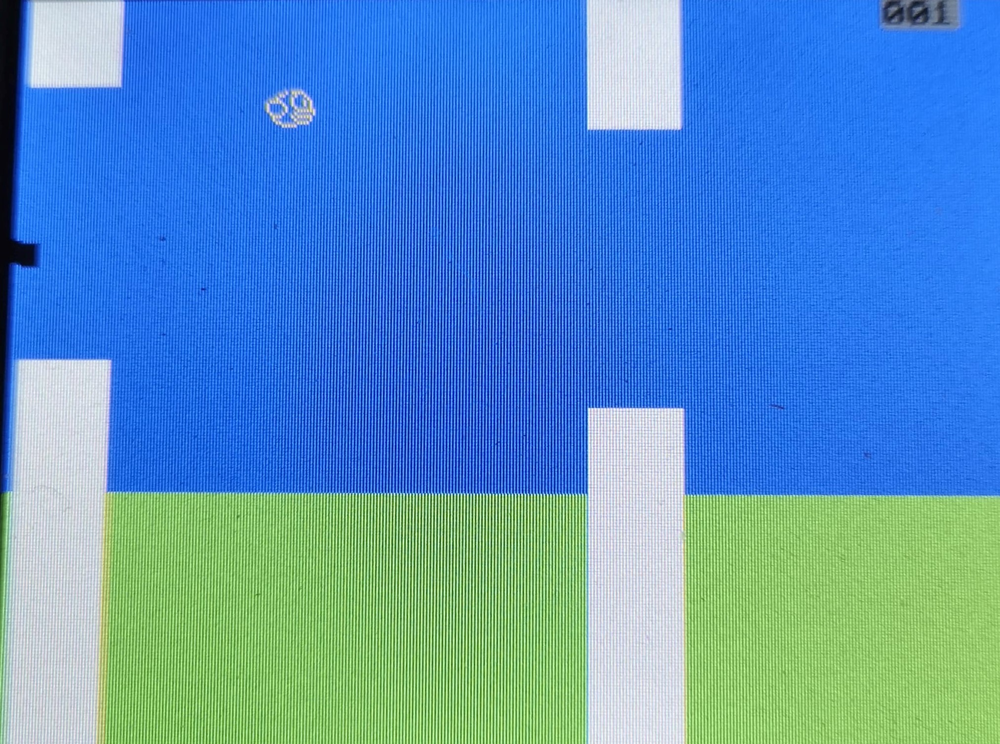

# Term project 2020
Making a game in C on an EFM32GG MCU using a uCLinuc operating system

Some pictures from the game. 

The character is controlled using an external gamepad with 8 buttons. These are connected through the GPIO pins on the development board.
For the game to communicate with hardware, a char driver has been developed. Its interrupt triggers a function
in the game to be executed. THis is how the entire game is controlled.

